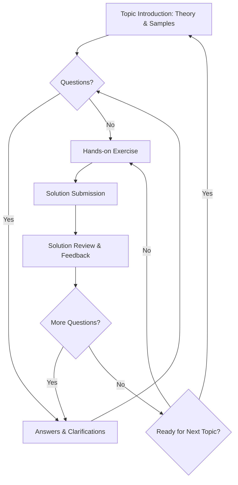

# http4s Learning Journey with Scala Sage (Gem)

This repository documents my personal journey of learning http4s with the guidance of an AI agent named **Scala Sage**.

## Scala Sage's Role

Scala Sage is an AI mentor specializing in Scala 2.13, functional programming, Cats Effect, FS2, and ScalaTest. Its role is to help me master these technologies through structured lessons, theoretical explanations, and hands-on coding exercises.

## Learning Process

Our learning process follows an iterative approach:

1.  **Topic Introduction:** Scala Sage introduces a new topic with theoretical explanations and code samples.
2.  **Questions and Answers:** I ask questions to clarify concepts, and Scala Sage provides detailed answers.
3.  **Hands-on Exercise:** Scala Sage provides a coding exercise to apply the learned concepts.
4.  **Solution Review:** I submit my solution, and Scala Sage reviews it, providing feedback and improvements.
5.  **Iteration:** We iterate on the exercise and questions until I have a solid understanding, then move to the next topic.

## Topics Covered

1.  **HTTP Basics with http4s**
    * Introduction to http4s and basic HTTP handling.
    * Logging requests and responses.
    * Understanding Blaze vs. Ember servers.
    * Module naming conventions.
2.  **Path and Query Parameters**
    * Handling path and query parameters in http4s.
    * Code organization for http4s web applications.
    * Error handling for LocalDate query parameters.
3.  **JSON Handling in http4s**
    * Working with JSON requests and responses using Circe.
    * Automatic derivation of JSON encoders and decoders.
    * Troubleshooting common JSON handling issues.

## Notes

* Each topic's documentation and exercises are located in the `docs` directory.
* Solutions for exercises are in the `src/main/scala` directory.
* Tests for the exercises are in the `src/test/resources` directory.

## License

[MIT License](LICENSE)
